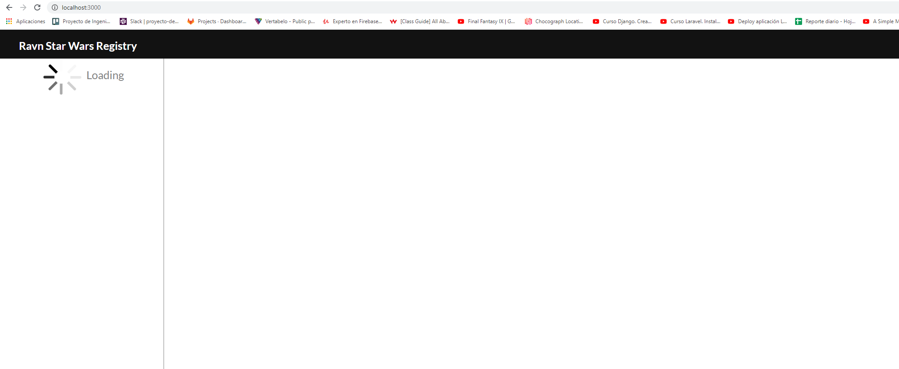
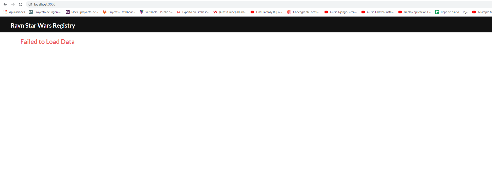
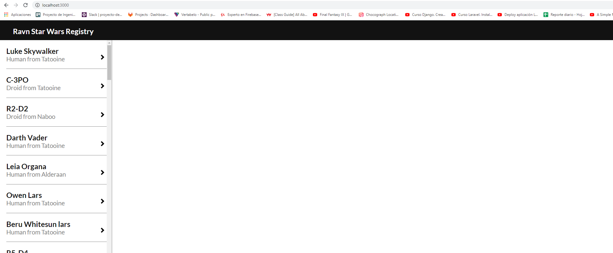
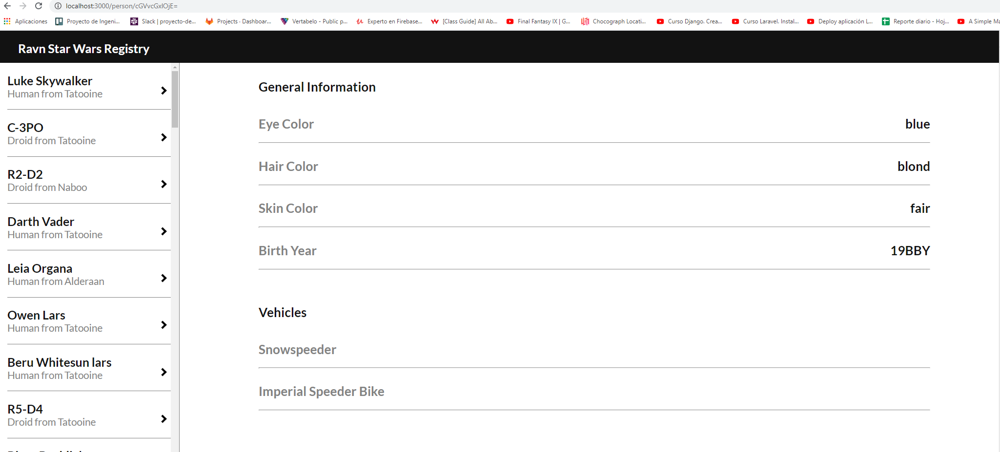

# Ravn-Challenge-V2-Iam-Contreras

This project is a Ravn GraphQL Code Challenge 

## Setup/Running instructions

Use `npm install` to install node_modules and `npm start` to start the app

## Project description

The present proyect use apollo client to conect with the star wars api. It has been developed with visual studio code in windows 10. The file App.js contains the direct endpoint to the api. The others files were order in the folder .css for the styles, and in the folder js for javascript files with the objective to have a good order. In the file PersonList.js it was made a query to get all persons from the api, then, it was use react-route-dom to send the id from one person to the file PersonDetails.js to get the details of that person with another query. Finally there are two files called Spinner.js and Spinner.cs, with them it build the loading-cell.

## Screenshots

- Loading Page

- Failed Page

- allPersons Page

- detailPerson Page

## Technologies used

- visual studio code
- reactjs
- apollo client
- graphql